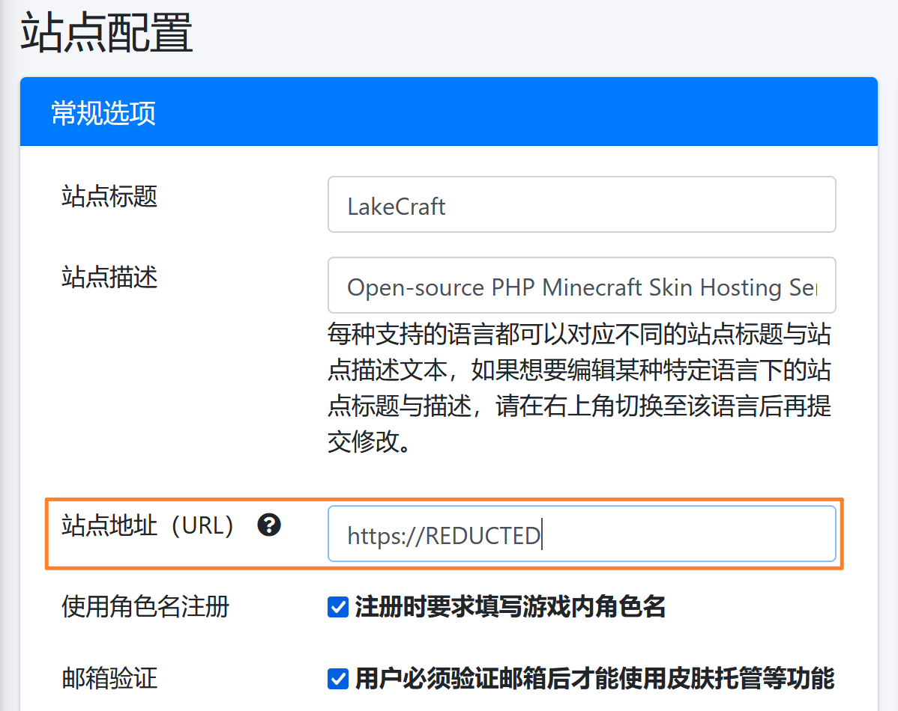

+++
title = 'Blessing Skin 的部署和其中的巨坑'
date = 2022-10-03T20:15:50+08:00
draft = false
+++

## 部署
关键词：PHP-fpm, nginx

真的，部署部分在文中所占的比例和现实中我花的时间是基本符合的。这是我第二次配 BlessingSkin，我依然花了不下6个小时排查各类问题。之前也配过 WordPress 的博客，可以说 PHP 这门 ~~*世界上最好的*~~ 语言给我留下的无一例外 全部 都 是负面印象。没有一次能照着文档一遍过的。

## 如果你想使用 SQLite 数据库……
数据库路径必须是绝对路径
```shell
$ nano .env
DB_CONNECTION=sqlite
DB_DATABASE=/mc/blessing/storage/blessingskin.db
```

## 完全白屏
问题的原因有很多，可以试着从以下两个方面入手。
1. 查看官方[FAQ](https://blessing.netlify.app/faq.html)
2. 开启 php 的 `display_errors` 查看详情

## 提示需要禁用 `open_basedir`
BlessingSkin 开发者认为 php 配置过于繁琐（事实上也的确是让人自闭的繁琐），并且收到了很多有关这项安全功能的 issue，所以决定在代码中阻止用户使用这项功能。然而，绝大多数用户是在不知情的情况下从`nginx`的`fastcgi`相关配置中开启了这项功能（没错就是我😭），而开发者却提示用户在`php.ini`中关闭它，让原本还算勉强能跑的事情变得更迷惑了……

该设定或许会在下一版本中被移除。

[BlessingSkin 关于 open_basedir 的说明](https://blessing.netlify.app/faq.html#require-open-basedir-restriction-in-effect-file-is-not-within-the-allow-path-s)
```nginx
# 404
try_files                     $fastcgi_script_name =404;

# default fastcgi_params
include                       fastcgi_params;

# fastcgi settings
fastcgi_index                 index.php;
fastcgi_buffers               8 16k;
fastcgi_buffer_size           32k;

# fastcgi params
fastcgi_param DOCUMENT_ROOT   $realpath_root;
fastcgi_param SCRIPT_FILENAME $realpath_root$fastcgi_script_name;

# 注意这里
#fastcgi_param PHP_ADMIN_VALUE "open_basedir=$base/:/usr/lib/php/:/tmp/";
```

## 500错误 Laraval: View [???] not found
请修复文件的读写权限。
`chmod o+rw -R .`

## 注册时无法显示验证码 (500)
[他人在简书上的说明](https://www.jianshu.com/p/bac22cbbdc7f)

如果你使用 Docker 的话，可以用这份 Dockerfile 来创建一个镜像。
```Dockerfile
FROM php:fpm
RUN apt-get update; apt-get install -y --no-install-recommends libfreetype6-dev libjpeg62-turbo-dev libpng-dev libzip-dev; \
        rm -rf /var/lib/apt/lists/*; \
        docker-php-ext-configure gd --with-freetype --with-jpeg; \
        docker-php-ext-install -j$(nproc) gd zip;
```

## 邮箱发信配置
在官方文档中没有提到。可以去修改 `.env` 文件。
这里提一下 `MAIL_ENCRYPTION` 选项。注意，如果你的邮箱提到了 `STARTTLS` 这个单词，请按如下配置。

[Swift Mailer 文档](https://swiftmailer.symfony.com/docs/sending.html#encrypted-smtp)
```shell
...
MAIL_ENCRYPTION=tls # 代表 STARTTLS
...
```

## 游戏内不能正常加载皮肤
检查站点 URL 配置是否正确

